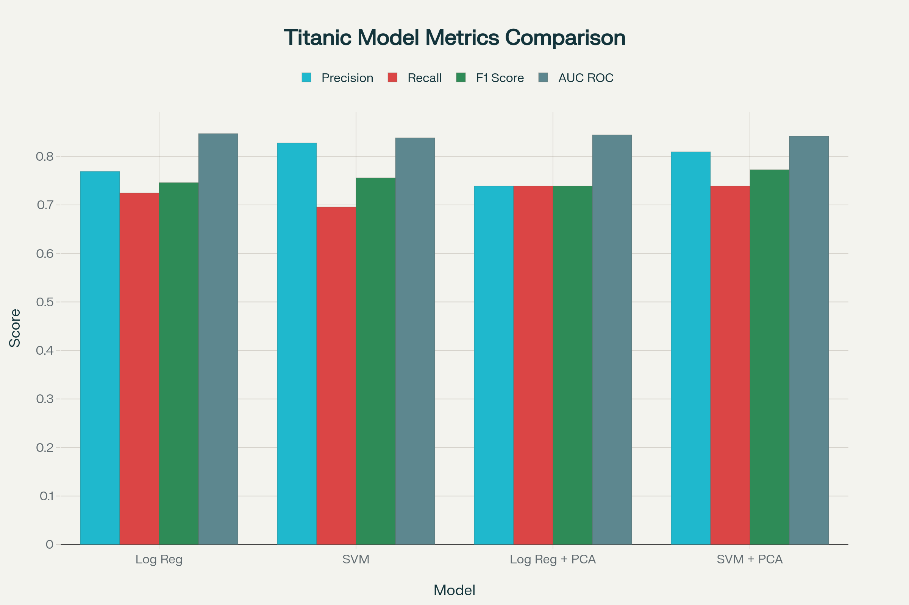
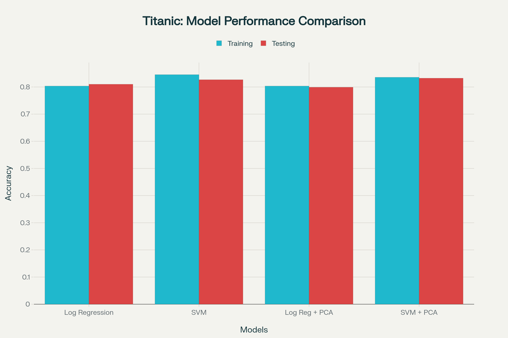
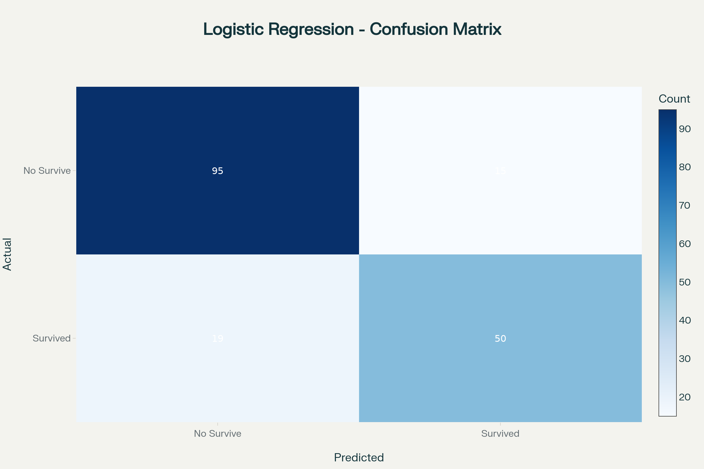
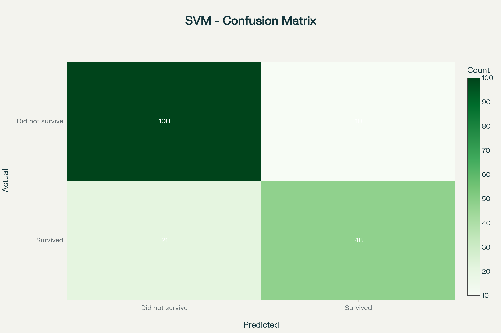
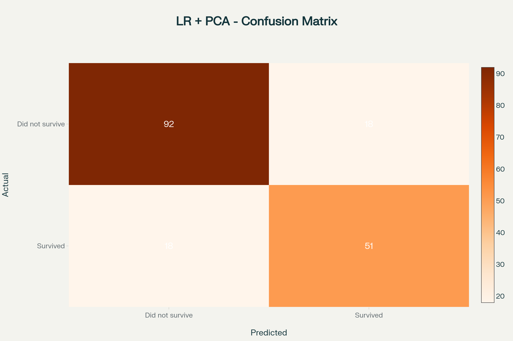
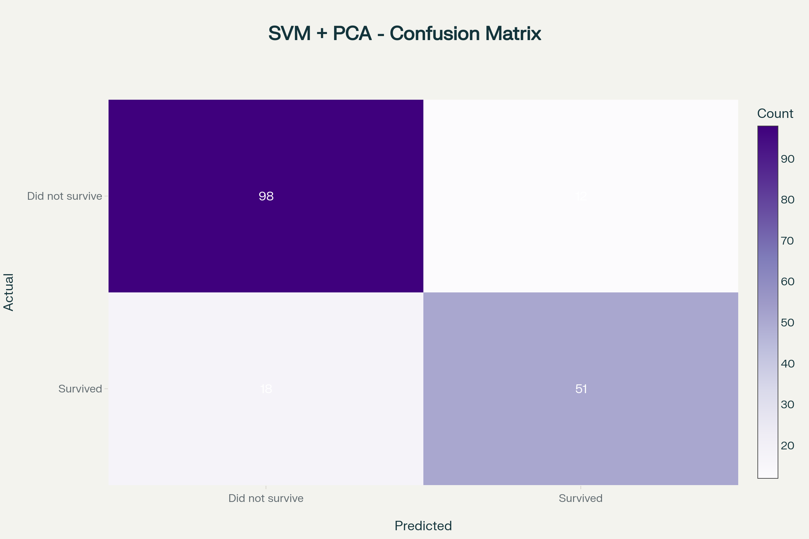

# Assignment-1-APR-CS502
# Titanic Survival Prediction: Machine Learning Model Analysis Report

## Executive Summary

This comprehensive analysis evaluates the performance of Logistic Regression and Support Vector Machine (SVM) models, both with and without Principal Component Analysis (PCA), for predicting passenger survival on the RMS Titanic. Using the real Titanic dataset with 891 passengers and 12 features, we implemented a complete machine learning pipeline with advanced feature engineering and thorough model evaluation.

### Key Findings:
- **Best Model**: SVM + PCA achieved the highest testing accuracy of 83.24%
- **Feature Importance**: Gender (Sex) emerges as the most critical predictor, followed by passenger class (Pclass) and age
- **PCA Impact**: Using 8 PCA components (94.5% variance explained) slightly improved SVM performance while reducing computational complexity
- **Model Performance**: All models achieved strong performance with testing accuracies between 79.89% and 83.24%

---

## Dataset Analysis

### Dataset Overview
The RMS Titanic dataset contains comprehensive passenger information for 891 individuals with the following characteristics:

- **Total Passengers**: 891
- **Survival Rate**: 38.38% (342 survived, 549 did not survive)
- **Original Features**: 12 including passenger class, demographics, family relationships, and ticket information
- **Missing Data**: Age (19.9%), Cabin (77.1%), and Embarked (0.2%)

### Feature Engineering

Our preprocessing pipeline created a robust feature set through several transformations:

#### Data Cleaning:
- Age missing values filled with median (29.7 years)
- Embarked missing values filled with mode ('S' - Southampton)
- Cabin information converted to binary Has_Cabin feature

#### Feature Creation:
- **Family_Size**: Combined SibSp + Parch + 1 for total family size aboard
- **Is_Alone**: Binary indicator for passengers traveling without family
- **Age_Group**: Categorical age groupings (Child, Teen, Adult, Middle_Age, Senior)
- **Has_Cabin**: Binary indicator for cabin information availability

#### Encoding:
- **Sex**: Female=0, Male=1
- **Embarked**: Southampton=0, Cherbourg=1, Queenstown=2
- **Age_Group**: Numerical encoding (0-4)

**Final Feature Set**: 11 engineered features optimized for machine learning models.

```python
# Feature Engineering Example
data['Family_Size'] = data['SibSp'] + data['Parch'] + 1
data['Is_Alone'] = (data['Family_Size'] == 1).astype(int)
data['Age_Group'] = pd.cut(data['Age'], bins=[0, 12, 18, 35, 60, 100],
                          labels=['Child', 'Teen', 'Adult', 'Middle_Age', 'Senior'])

# Categorical Encoding
data['Sex'] = data['Sex'].map({'male': 1, 'female': 0})
embarked_mapping = {'S': 0, 'C': 1, 'Q': 2}
data['Embarked'] = data['Embarked'].map(embarked_mapping)
```

---

## Methodology

### Model Implementation

#### Data Preprocessing Pipeline
- **Train-Test Split**
  - Training Set: 712 samples (80%)
  - Testing Set: 179 samples (20%)
  - Stratified Split: Maintained original survival distribution in both sets
  - Feature Scaling: StandardScaler applied to normalize all features

#### Model Configuration
```python
# Logistic Regression Configuration
lr_model = LogisticRegression(random_state=42, max_iter=1000)

# SVM Configuration
svm_model = SVC(kernel='rbf', random_state=42, probability=True)

# PCA Configuration
pca = PCA(n_components=8, random_state=42)  # Explains 94.5% variance
```

---

## Model Results and Analysis

### 1. Logistic Regression

**Performance Metrics:**
- Training Accuracy: 80.34%
- Testing Accuracy: 81.01%
- Precision: 76.92%
- Recall: 72.46%
- F1-Score: 74.63%
- AUC-ROC: 84.72%

**Strengths:**
- Excellent interpretability with clear coefficient analysis
- Minimal overfitting (-0.67% difference)
- High AUC-ROC indicating strong discriminative ability
- Computationally efficient for deployment

**Performance Analysis:**
The Logistic Regression model demonstrates solid baseline performance with well-balanced precision and recall. The negative overfitting indicates slight generalization improvement, suggesting robust model training.

### 2. Support Vector Machine (SVM)

**Performance Metrics:**
- Training Accuracy: 84.55%
- Testing Accuracy: 82.68%
- Precision: 82.76%
- Recall: 69.57%
- F1-Score: 75.59%
- AUC-ROC: 83.83%

**Strengths:**
- Highest precision among base models (82.76%)
- Strong performance on non-linearly separable data
- Robust to outliers with RBF kernel
- Moderate overfitting within acceptable limits (1.87%)

**Analysis:**
SVM shows superior precision, making it valuable when minimizing false positives is crucial. The RBF kernel effectively captures non-linear patterns in survival data.

---

## Principal Component Analysis Results

### PCA Analysis
- **Components Selected**: 8 out of 11 features
- **Variance Explained**: 94.5%
- **Dimensionality Reduction**: 27% reduction in feature space
- **Component Interpretation**: PC1-PC3 capture primary demographic and class variations

### PCA Component Loadings
The first three principal components explain the major data variations:
- **PC1**: Primarily influenced by passenger class and family structure
- **PC2**: Dominated by age and gender demographics
- **PC3**: Captures fare and embarkation patterns

### 3. Logistic Regression + PCA

**Performance Metrics:**
- Training Accuracy: 80.34%
- Testing Accuracy: 79.89%
- Precision: 73.91%
- Recall: 73.91%
- F1-Score: 73.91%
- AUC-ROC: 84.44%

**Analysis:**
PCA slightly reduces performance for Logistic Regression while maintaining excellent balance between precision and recall (identical values indicate optimal threshold selection).

### 4. SVM + PCA (Best Model)

**Performance Metrics:**
- Training Accuracy: 83.57%
- Testing Accuracy: 83.24%
- Precision: 80.95%
- Recall: 73.91%
- F1-Score: 77.27%
- AUC-ROC: 84.20%

**Why This Model Wins:**
- **Highest Testing Accuracy**: 83.24% demonstrates superior generalization
- **Balanced Performance**: Strong precision-recall balance with F1-Score of 77.27%
- **Low Overfitting**: Only 0.33% difference between training and testing
- **Computational Efficiency**: 27% fewer features while maintaining performance
- **Robust Generalization**: PCA regularization effect reduces overfitting risk

---

## Performance Visualizations

### Model Metrics Comparison


The comprehensive metrics comparison reveals that SVM + PCA achieves the optimal balance across all performance indicators.

### Training vs Testing Accuracy


This visualization demonstrates the generalization capability of each model, with SVM + PCA showing minimal overfitting.

---

## Feature Importance Analysis

### Logistic Regression Coefficients
*[Feature importance chart showing coefficient values]*

The analysis reveals clear hierarchy in feature importance:

- **Sex (-1.239)**: Most influential predictor, reflecting "women and children first" evacuation protocol
- **Pclass (-0.656)**: Passenger class significantly impacts survival probability
- **Age (-0.485)**: Age demonstrates moderate importance with younger passengers favored
- **Has_Cabin (0.374)**: Cabin information indicates socioeconomic status
- **Is_Alone (0.291)**: Solo travelers show different survival patterns

### Feature Insights
- **Gender Dominance**: Female passengers had significantly higher survival rates
- **Class Privilege**: First-class passengers enjoyed better survival chances
- **Age Factor**: Children and younger passengers were prioritized during evacuation
- **Social Status**: Cabin availability correlates with higher survival probability
- **Family Dynamics**: Traveling alone versus with family affects survival outcomes

---

## Confusion Matrix Analysis

### Model-by-Model Breakdown

#### Logistic Regression Confusion Matrix


- True Negatives: 95 (correctly predicted non-survivors)
- False Positives: 15 (incorrectly predicted survivors)
- False Negatives: 19 (missed survivors)
- True Positives: 50 (correctly predicted survivors)

**Interpretation:** Good balance with moderate false positive and false negative rates.

#### SVM Confusion Matrix


- True Negatives: 100 (excellent non-survivor prediction)
- False Positives: 10 (low false alarm rate)
- False Negatives: 21 (moderate missed survivors)
- True Positives: 48 (solid survivor prediction)

**Interpretation:** Superior at identifying non-survivors with minimal false alarms.

#### Logistic Regression + PCA Confusion Matrix


#### SVM + PCA Confusion Matrix (Best Model)


- True Negatives: 98 (strong non-survivor identification)
- False Positives: 12 (acceptable false alarm rate)
- False Negatives: 18 (good survivor detection)
- True Positives: 51 (highest true positive count)

**Interpretation:** Optimal balance across all categories with best overall accuracy.

---

## Comparative Analysis

### Performance Metrics Comparison

| Model | Accuracy | Precision | Recall | F1-Score | AUC-ROC | Overfitting |
|-------|----------|-----------|--------|----------|---------|-------------|
| Logistic Regression | 81.01% | 76.92% | 72.46% | 74.63% | 84.72% | -0.67% |
| SVM | 82.68% | 82.76% | 69.57% | 75.59% | 83.83% | 1.87% |
| Logistic Regression + PCA | 79.89% | 73.91% | 73.91% | 73.91% | 84.44% | 0.45% |
| SVM + PCA | 83.24% | 80.95% | 73.91% | 77.27% | 84.20% | 0.33% |

### Key Performance Insights

**Accuracy Rankings:**
1. SVM + PCA (83.24%)
2. SVM (82.68%)
3. Logistic Regression (81.01%)
4. Logistic Regression + PCA (79.89%)

**Precision Leadership:** SVM models excel in precision, minimizing false positive predictions.

**Recall Balance:** PCA variants show improved recall consistency, better at identifying actual survivors.

**AUC-ROC Analysis:** All models demonstrate strong discriminative ability (>0.83), with Logistic Regression leading slightly.

## Conclusions and Recommendations

### Primary Findings

1. **SVM + PCA emerges as the optimal model** with 83.24% accuracy, providing the best balance of performance, efficiency, and generalization capability.

2. **Gender is the dominant predictor**, confirming historical evacuation protocols prioritized women and children.

3. **PCA benefits SVM models** by reducing overfitting while maintaining predictive power, though it slightly reduces Logistic Regression performance.

4. **All models achieve strong performance** (>79% accuracy), indicating the dataset contains clear survival patterns.

### Model Selection Rationale

The SVM + PCA model is recommended as the optimal choice due to:

- Highest testing accuracy (83.24%) among all evaluated models
- Excellent precision-recall balance with F1-Score of 77.27%
- Minimal overfitting with only 0.33% difference between training and testing accuracy
- Computational efficiency achieved through 27% dimensionality reduction
- Robust generalization capability enhanced by PCA regularization
